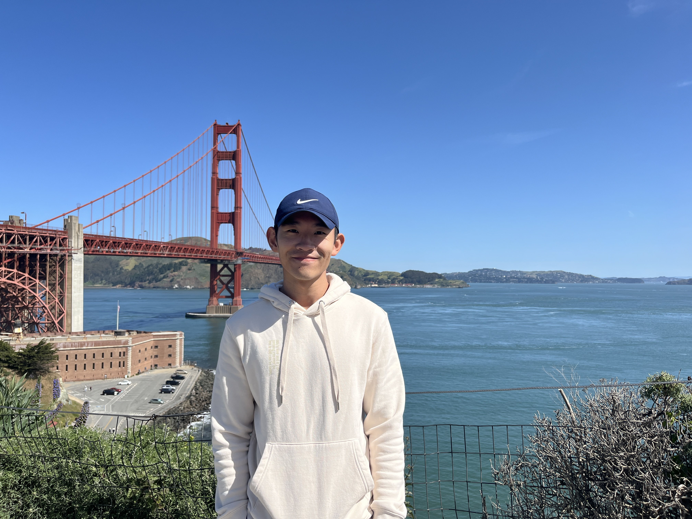

---
# This is "front matter"
# It tells Jekyll to use the default template from the theme
layout: default 
---

# Dayuan Wang
Ph.D. Student in Biostatistics.  
University of Florida, Gainesville, FL  
Email: [dayuan.wang@ufl.edu](mailto:dayuan.wang@ufl.edu)  

[LinkedIn](https://www.linkedin.com/in/dayuan-wang-bios/) | [GitHub](https://github.com/dayuan-wang) | [Google Scholar](https://scholar.google.com/citations?user=1QoaNEMAAAAJ&hl=en) 

## Writing
I share short research notes, technical posts, and project updates here:
[Browse all articles (tree view)](/articles/)

### Latest posts


* **{{ post.date | date: "%b %d, %Y" }}** - [{{ post.title }}]({{ post.url }})


* No articles yet. First post coming soon.


## Curiosities
* A minigame to test your marketing intuition. [Click here.](https://dayuan-wang.github.io/Market-maker-game/)

## About me
I am a Ph.D. student in Biostatistics at the University of Florida (Aug 2022 - Dec 2026). 
I am a Doctorate Research Assistant at the Sepsis and Critical Illness Research Center at University of Florida,
focuses on driving translational research by applying multi-omics data to uncover immune mechanisms in critical illness.
I design and validate robust, reproducible end-to-end bioinformatics pipelines for sequencing data (e.g., scRNA-seq, bulk RNA-seq) using R/Python in an HPC environment.

## Research Interests
* **Omics & Bioinformatics:** scRNA-seq, RNA-seq, Multi-omics integration, Immune profiling, Variant calling, CNV detection, Spatial transcriptomics analysis, Copy number variation (CNV) detection, Oncology
* **Statistical Skills:** Machine learning, Deep learning, Survival analysis, Longitudinal analysis, Mixed-effects models, Causal inference, GLM, Sample size calculation, RWE
* **Tools and Languages:** R, Python, SAS, SQL, TensorFlow, Linux (HPC environments, Slurm)

## News
* **[Aug 2025]** I will be speaking at the Joint Statistical Meetings (JSM) in Nashville, TN. My talk is titled: "CN-RNN: a Supervised Learning Framework for Copy Number Variation Detection with Sequencing Data".
* **[Jun 2025]** I presented a poster at the SHOCK Conference in Boston, MA, on "Sc-RNA Seq Identifies Age as Effect Modifier of Lymphocytes' Transcriptomic Changes in Murine Sepsis".

## Publications
* **D Wang**, C Rodhouse, H Tang, et al. "Single-cell Transcriptomic Analysis Reveals Age- but not Sex-dependent Lymphocyte Immune Responses in Murine Sepsis."
    (In Preparation). (2025).
* **D Wang**, F Qin et al. "CN-RNN: a Supervised Learning Framework for Copy Number Variation Detection with Sequencing Data."
    (In Preparation). (2025).
* JC Rincon, **D Wang**, VE Polcz, et al. "Innate immune training in the neonatal response to sepsis."
    *Molecular Medicine*, 31(1), 159. (2025).
* C Rodhouse, **D Wang**, H Tang, et al. "Age-and Sex-Driven Transcriptional and Metabolic Diversity in Myeloid-Derived Suppressor Cells After Mouse Sepsis."
    *bioRxiv*, 2025.10.06.680736. (2025).

## Honors and Awards
* PhD Fellowship in Artificial Intelligence, University of Florida, FL (2024-2025)
* Department Achivement Award, Preliminary Exam Award, University of Florida, FL (Aug 2023)
* Student Research Travel scholarship, Rutgers Univeristy, NJ (Nov 2019)
* Outstanding Undergraduate Student Scholarship Peking University, China (2014 - 2018)
* Gold Medal, 25th International Biology Olympiad Bali, Indonesia (July 2014)

## Activities
